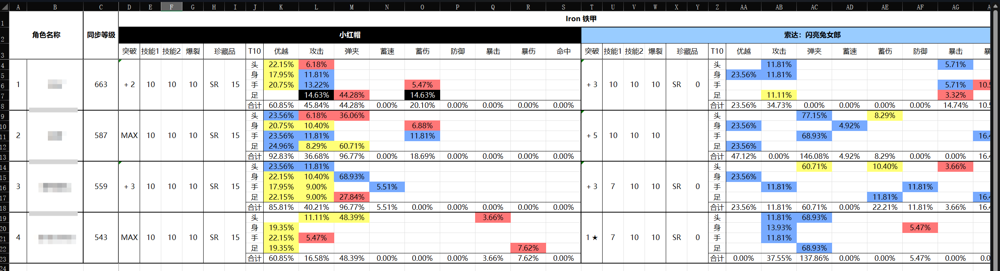

# ExiaInvasion

**ExiaInvasion** is an open source crawler program that obtains Nikke character data in personal accounts from [blablalink](https://www.blablalink.com/) and generates progress tracker

**ExiaInvasion** 是一个从 [blablalink](https://www.blablalink.com/) 获取个人账号中的Nikke人物数据并生成练度表的开源爬虫程序

## Example output 示例输出

## Notice 注意

- **Edge** or **Chrome** is required to run the program

	需要 **Edge** 或 **Chrome** 浏览器
	
- First run may not open the webpage properly and report errors continuously. Please close the program and browser and run again.

	第一次运行可能无法正常打开网页并连续报错，请关闭程序与浏览器并重新运行

- Currently only tables in Simplified Chinese and English can be output.

  目前仅能输出简体中文和英文表格

## Usage 用法

- Please fill in all account information into **LoginIndex** , do not delete the first row header

  请将所有账号信息填入 **LoginIndex** ，不要删去第一行表头

- **merge** can merge all tables in the same directory

  **merge** 将合并同目录中的所有表格

- **SearchIndexEng** is used to provide the role search index of the main program **ExiaInvasion**. Roles can be added or deleted. The role name defaults to Simplified Chinese. The file can be changed as needed according to **nikke_list_English**  

	**SearchIndexChs** 用于提供主程序 **ExiaInvasion** 的角色搜索索引，可添加或删除角色，可对照 **nikke_list_繁體中文** 按需更改

- `"priority"` is based on my personal subjective character priority, only for tabulation purposes, black>blue>yellow

	`“priority”`是依据我个人主观的角色优先级，仅用于制表，黑>蓝>黄

- Equipment Effects have 15 levels. Levels 1-5 are marked in red, levels 6-10 are marked in yellow, levels 11-14 are marked in blue, and level 15 are marked in black.

  装备词条有15级，1-5级为红色，6-10级标记为黄色，11-14级标记为蓝色，15级标记为黑色

## [统计角色](https://www.kdocs.cn/l/cqaoCnPqbPpM)

## Communication and feedback 交流与反馈

[Discord](https://discord.gg/rN7CrqmY)

[Github](https://github.com/IsolateOB/ExiaInvasion)

[东南亚服交流QQ群](https://qm.qq.com/q/hznFzFRAf8)

